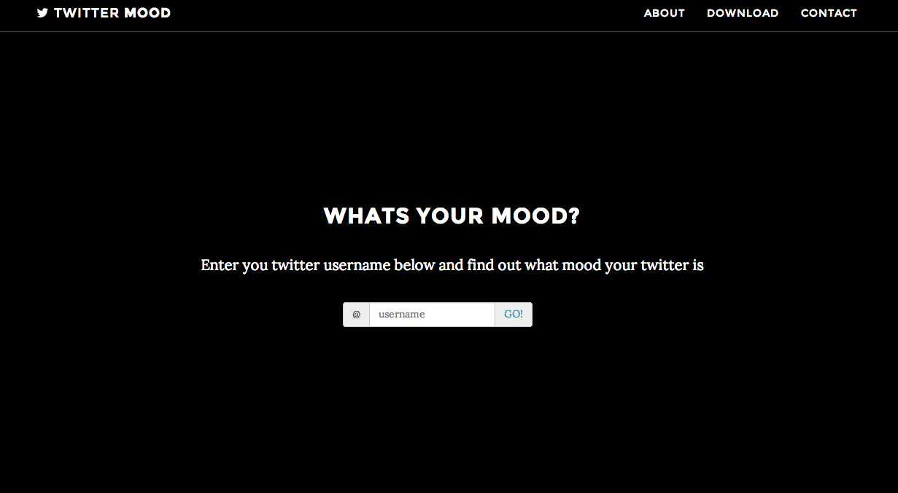
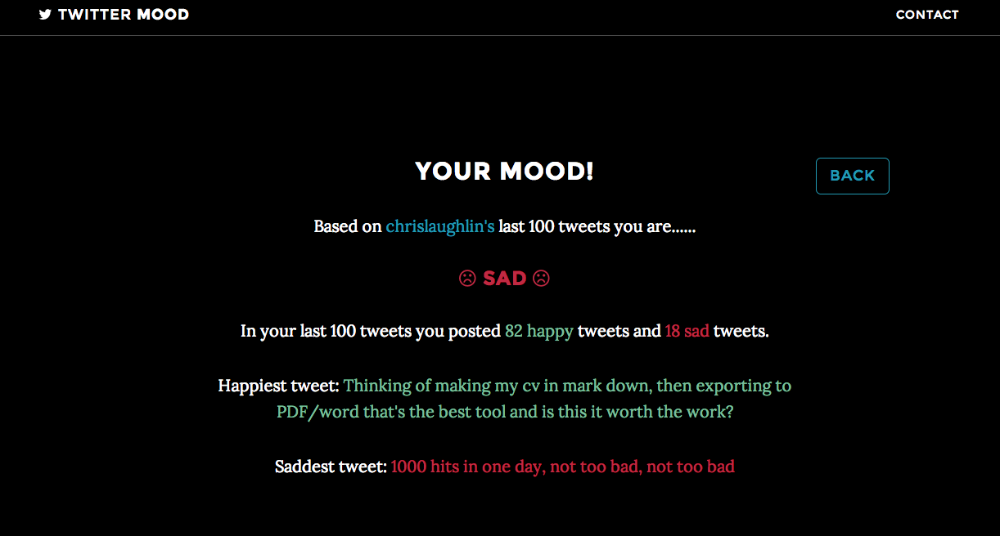

[Demo](http://guarded-inlet-6923.herokuapp.com/#/main)

Titter Mood
============

Web application that lets you see what mood you twitter status have been. Happy or sad youll see what mood you have been
 in when posting to Twitter.

Install and run
----------------

``` bash
npm install
bower install
node server/src/server
```
Open your browser to http://localhost:3000/

Tests
------

To run tests you must install jasmine node as a global

``` bash
npm install jasmine-node -g
```

Then run the tests

``` bash
jasmine-node server/test/
```

Technologies Used
------------------
+ [NodeJS](http://nodejs.org/)
+ [ExpressJS](http://expressjs.com/)
+ [Twit](https://github.com/ttezel/twit)
+ [Sentiment](https://www.npmjs.org/package/sentiment)
+ [AngularJS](https://angularjs.org/)

Screen shots
---------------
# Main Screen

# Mood Input Screen

# Mood Results



